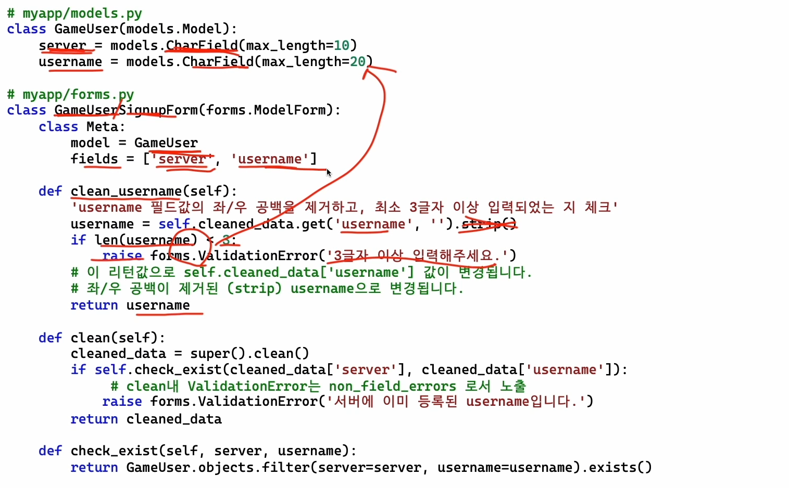

# 6-3

## Form 유효성검사 호출 로직

- form.full_clean() 호출
  - 각 필드 객체 별로 각 필드객체 .clean() 호출을 통해 Type에 맞춰서 검사
  - Form 객체 내에서
  - 필드 이름별로 Form객체.clean_필드명() 함수가 있다면 호출해서 검사
  - Form객체_clean() 함수가 있다면 호출해서 검사
- 에러 유무에 따른 True/False 리턴

## Bulit-In Validators

`RegexValidator`  
`EmailValidator`  
`URLValidator`... 등등등  

## 언제 validators를 쓰고 언제 clean?

가급적이면 모든 `validators`는 모델에 정의하고, `ModelForm`을 통해 모델의 `validators` 정보도 같이 가져온다.  

`clean`이 필요할 때  

- 특정 Form에서 1회성 유효성 검사 루틴이 필요할 때
- 다수 필드값에 걸쳐서, 유효성 검사가 필요할 때
- 필드 값을 변경할 필요가 있을 때
  - validator는 값을 체크할뿐 값을 변경 할 순 없다.

## Validator 예시
